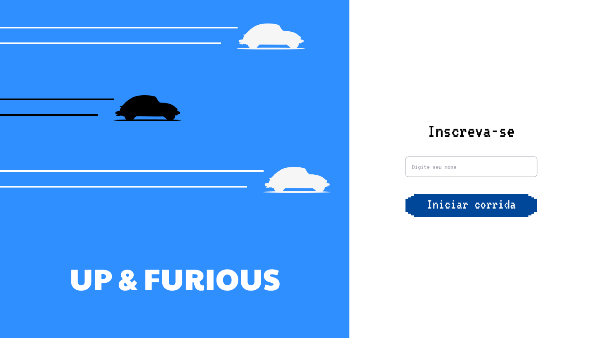
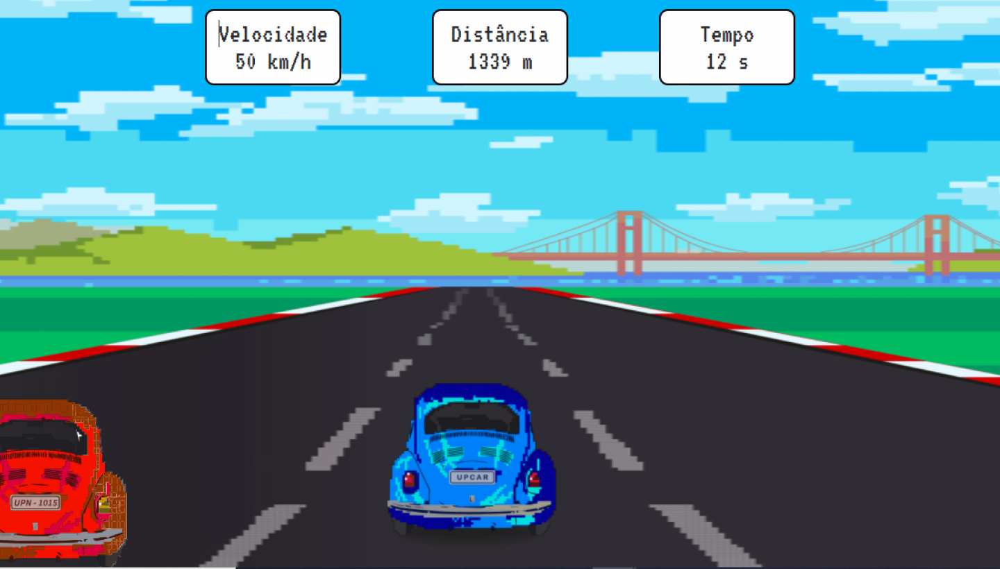

# UpRace

<p align="center">
  <a href="#-tecnologias">Tecnologias</a>&nbsp;&nbsp;&nbsp;|&nbsp;&nbsp;&nbsp;
  <a href="#-projeto">Projeto</a>&nbsp;&nbsp;&nbsp;|&nbsp;&nbsp;&nbsp;
  <a href="#-layout">Layout</a>&nbsp;&nbsp;&nbsp;|&nbsp;&nbsp;&nbsp;
  <a href="#-layout">Documentação</a>&nbsp;&nbsp;&nbsp;|&nbsp;&nbsp;&nbsp;
</p>

<br>

<p align="center">
  
  
</p>

## 🚀 Tecnologias

Esse projeto foi desenvolvido com as seguintes tecnologias:

- HTML
- [SASS](https://sass-lang.com/)
- [TypeScript](https://www.typescriptlang.org/)
- [React](https://reactjs.org/)

Bibliotecas

- [Google Fonts](https://fonts.google.com/)
- [React Hot Toasts](https://react-hot-toast.com/)

Serviços

- [Firebase](https://firebase.google.com/)

## 💻 Projeto

UP & FURIOUS é um jogo de corrida e desvio de obstáculos, single player feito no formato SPA(Single Page Application), para ser jogado através de um notebook ou desktop. Possui uma tela inicial para identificação do usuário, um modal com informações sobre os comandos para controlar o carro, a tela de jogo e uma página final de fim de jogo.

Você pode acessar o jogo através desse [link](https://up-and-furious.web.app/)

Para contribuir com o projeto, é necessário instalar o [git](https://git-scm.com/) e o [yarn](https://yarnpkg.com/) em sua máquina. Após fazer isso, clone esse repositório em sua máquina e rode o comando abaixo através da linha de comando:
```
yarn install
```
Após fazer isso, você deve rodar o seguinte comando para inicializar a aplicação em seu browser:
```
yarn start
```

## 🔖 Layout

Você pode visualizar o layout do projeto através [desse link](https://www.figma.com/file/Ll3iMfZdIwZD5npuRiwA1M/Up-and-Furious). É necessário ter conta no [Figma](https://figma.com) para acessá-lo.

## 📝 Documentação

Para entender como o jogo foi feito, confira a documentação neste [link]('link para Notion')

---

Feito com ♥ by [Lucas de Castro](https://www.linkedin.com/in/lucascastrorj/).
